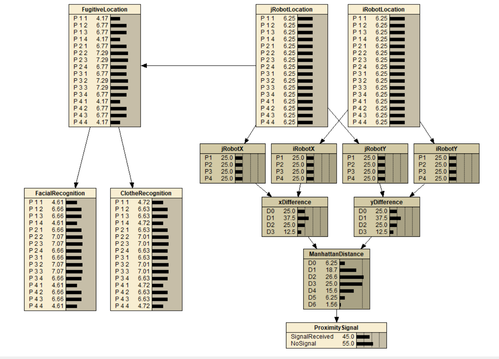
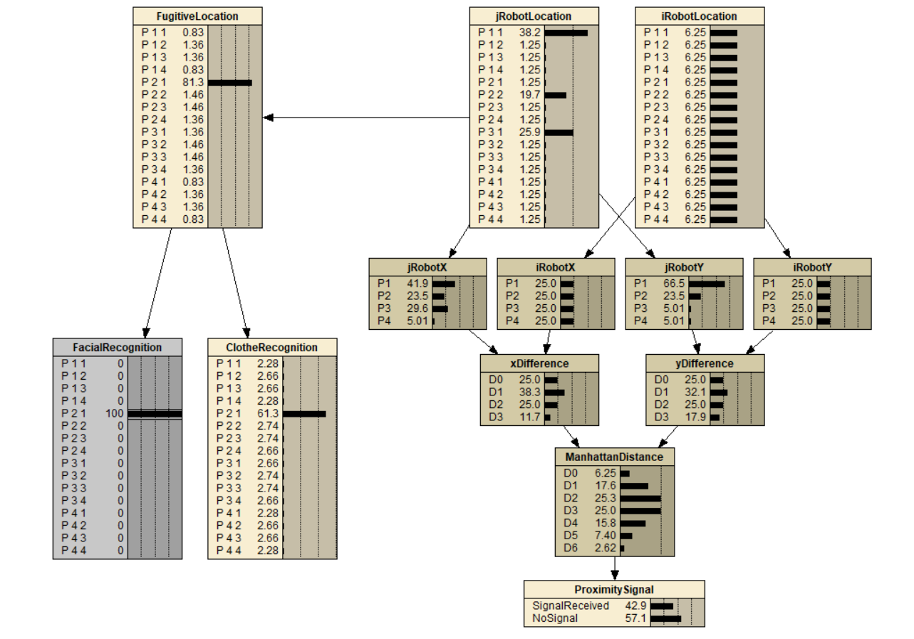
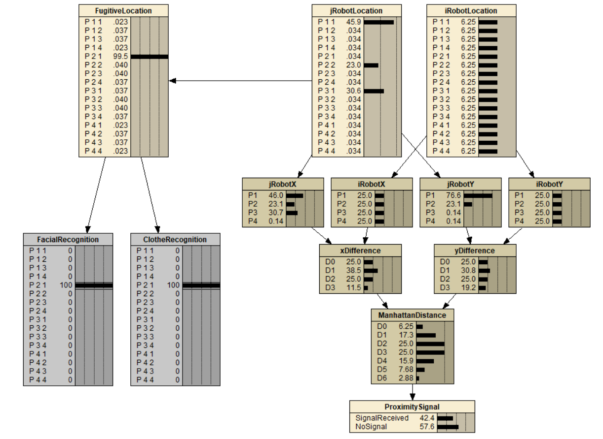
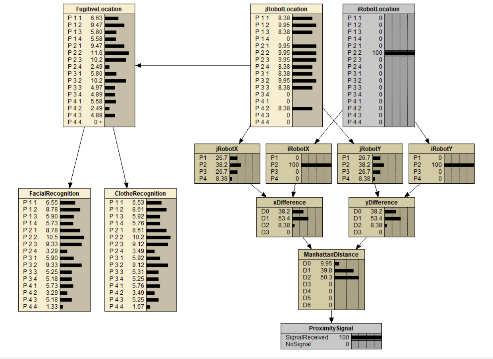
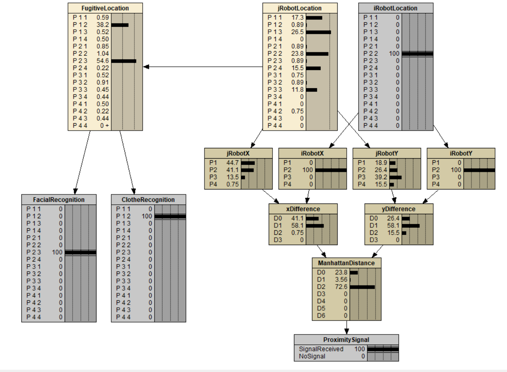
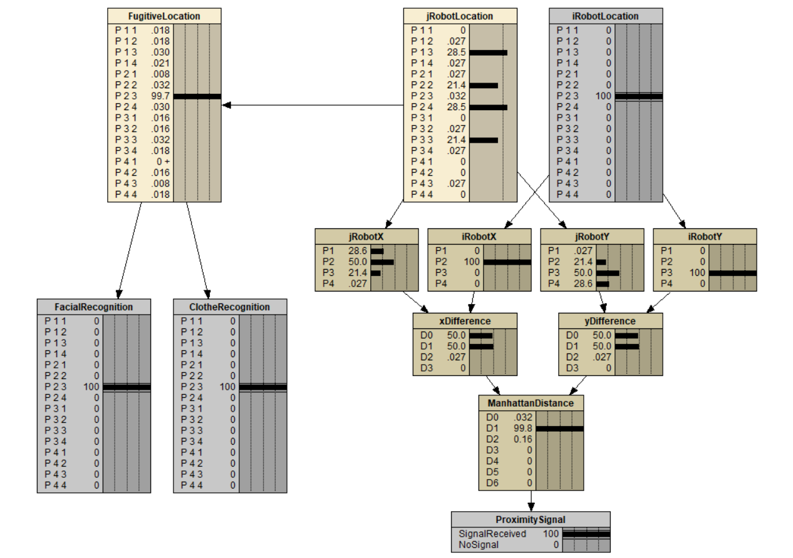

# Assignment 1: Probability and Bayesian Networks
Name: Jacob Kruse 
Student ID: 811103596 
Class: CSCI 8920 | Decision Making Under Uncertainty 

This folder contains all of my solutions to Parts I and II of Assignment 1. `Assignment_1.pdf` contains my scanned solutions for the written portions of the assignment. The `Fugitive_Network.dne` file is my Bayesian Network built with Netica to answer Part II.b.

As the name suggests, the `Assignment_Description.pdf` provides the guidelines and questions for this assignment. If you want to install Netica, please see Part II.a in this PDF.

## Part II.b
In my Bayesian Network, I assumed uniform probabilities for the locations of Robots i and j. Because the 4x4 grid has 16 locations, this leads to a probability of 1/16 or 6.25% that Robot i or Robot j is located in a specific cell of the grid. Shown in the image below is my Bayesian Network without any prior assumptions.

#### Solution Bayesian Network

### Part II.b.i
If a possible fugitive in sector (2,1) is positively recognized using his face but his clothes are not identified, what is the probability that the fugitive is in (2,1)? What is the most probable location(s) of the robot j?

Probability Fugitive is in (2,1): 
81.3%

Most Probable Locations of Robot j: 
(1,1) = 38.2% 
(3,1) = 25.9% 
(2,2) = 19.7%

### Part II.b.i (continued)
How does this probability change when the clothes are also identified? What is the most probable location(s) of the robot j?

Probability Fugitive is in (2,1): 
99.5%

Most Probable Locations of Robot j: 
(1,1) = 45.9% 
(3,1) = 30.6% 
(2,2) = 23.0%

### Part II.b.ii
If robot i’s proximity indicator goes off when it is in location (2,2), what are the probabilities that the fugitive is located in each of the 16 sectors?

Probability Fugitive is in each location: 
(1,1) = 6.63% 
(1,2) = 9.47% 
(1,3) = 5.80% 
(1,4) = 5.58% 
(2,1) = 9.47% 
(2,2) = 11.6% 
(2,3) = 10.2% 
(2,4) = 2.49% 
(3,1) = 5.80% 
(3,2) = 10.2% 
(3,3) = 4.97% 
(3,4) = 4.89% 
(4,1) = 5.58% 
(4,2) = 2.49% 
(4,3) = 4.89% 
(4,4) = >0%

### Part II.b.ii (continued)
What then becomes the most likely location of a fugitive if he is recognized by face only in (2,3) and by clothes only in (1,2)?

Most Probable Locations of Fugitive: 
(2,3) = 54.6% 
(1,2) = 38.2%

### Part II.b.iii
If the proximity indicator goes off when robot i is in sector (2,3) and the fugitive is spotted both by face and clothes in (2,3) as well, what is the most likely location(s) of the robot j?

Most Probable Locations of Robot j: 
(1,3) = 28.5% 
(2,4) = 28.5% 
(2,2) = 21.4% 
(3,3) = 21.4%

