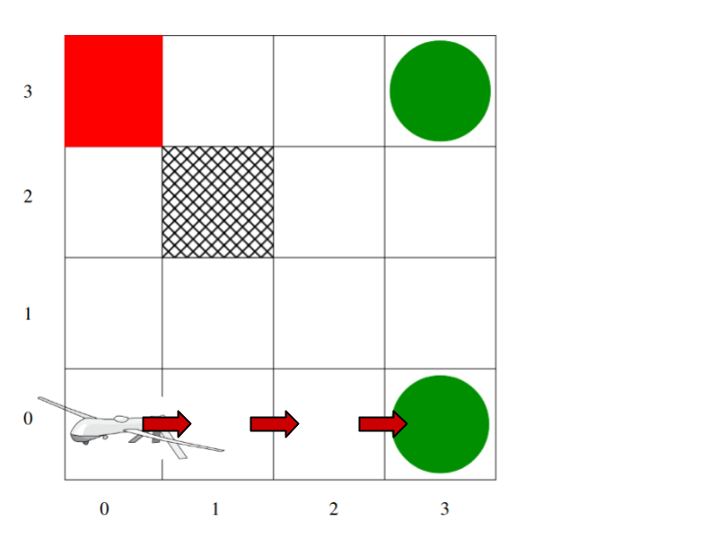
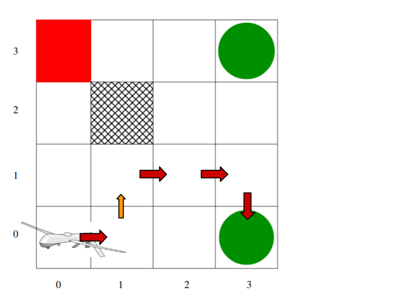
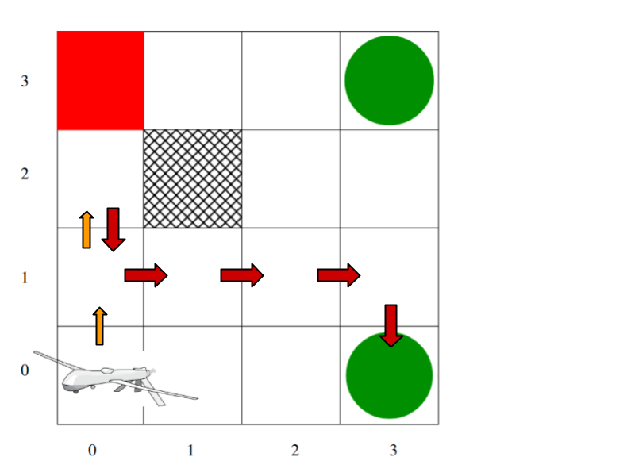
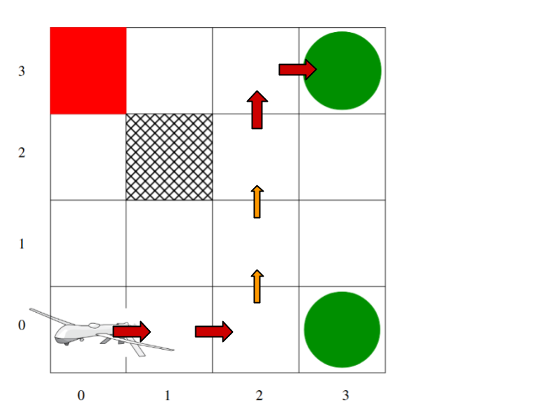

# Assignment 2: Decision Making in Single-Agent Settings
Name: Jacob Kruse 
Student ID: 811103596 
Class: CSCI 8920 | Decision Making Under Uncertainty 

This folder contains all of my solutions to Parts I and II of Assignment 2. `Assignment_2.pdf` contains my scanned solutions for Part I of the assignment. The `policy_iteration.cpp` file provides my solution for Part II. As the name suggests, the `Assignment_Description.pdf` provides the guidelines and questions for this assignment.

To compile `policy_iteration.cpp`, you can use the following command.

    g++ policy_iteration.cpp -o policy_iteration

This will create an executable called `policy_iteration` which can be executed with the following.

    ./policy_iteration

This script will perform policy iteration and output the resulting policy for the UAV 4x4 grid problem.

As requested by Part II.a, I have defined the MDP within the program. The states and actions are defined as a vector and array, respectively, and are located in the `main()` function at the bottom of the file. The transition and reward functions are defined by the `get_transitions()` and `get_reward()` functions, respectively. The initial policy is randomized as per the `initialize_policy()` function.

Additionally, the problem asks to provide a trajectory from the policy output from the program. Because some states, namely (3,0), (3,3), and (2,2), have multiple optimal actions, I will be using the following policy that was generated by `policy_iteration.cpp` to provide some possible trajectories.

    Converged Policy
    ---------------------------
    State: (0,0)  Action: Right
    State: (0,1)  Action: Right
    State: (0,2)  Action: Down
    State: (0,3)  Action: Right
    State: (1,0)  Action: Right
    State: (1,1)  Action: Right
    State: (1,3)  Action: Right
    State: (2,0)  Action: Right
    State: (2,1)  Action: Right
    State: (2,2)  Action: Up
    State: (2,3)  Action: Right
    State: (3,0)  Action: Down
    State: (3,1)  Action: Down
    State: (3,2)  Action: Up
    State: (3,3)  Action: Up

Due to the transition probability, it is possible to end up in a square that differs from the action direction. In the following trajectories, if the tranisiton is in the direction of the action, it is represented with a red arrow. If the agent transitions to a state that is not in the direction of the action, it is represented with an orange arrow.

### Trajectory 1
The first trajectory shown below is the result of every action having the desired effect.

(0,0) -> Right -> (1,0) -> Right -> (2,0) -> Right -> (3,0)

### Trajectory 2
The next trajectory shows the result of the second "Right" action transitioning to the square above rather than to the right.

(0,0) -> Right -> (1,0) -> Right -> (1,1) -> Right -> (2,1) -> Right -> (3,1) -> Down -> (3,0)

### Trajectory 3
The trajectory below shows the case where the first two "Right" actions transition to the squares above, and the resulting recovery of the policy.

(0,0) -> Right -> (0,1) -> Right -> (0,2) -> Down -> (0,1) -> Right -> (1,1) -> Right -> (2,1) -> Right -> (3,1) -> Down -> (3,0)

### Trajectory 4
The final trajectory shows the agent veering off course near the end and recovering to the other goal state.

(0,0) -> Right -> (1,0) -> Right -> (2,0) -> Right -> (2,1) -> Right -> (2,2) -> Up -> (2,3) -> Right -> (3,3)
